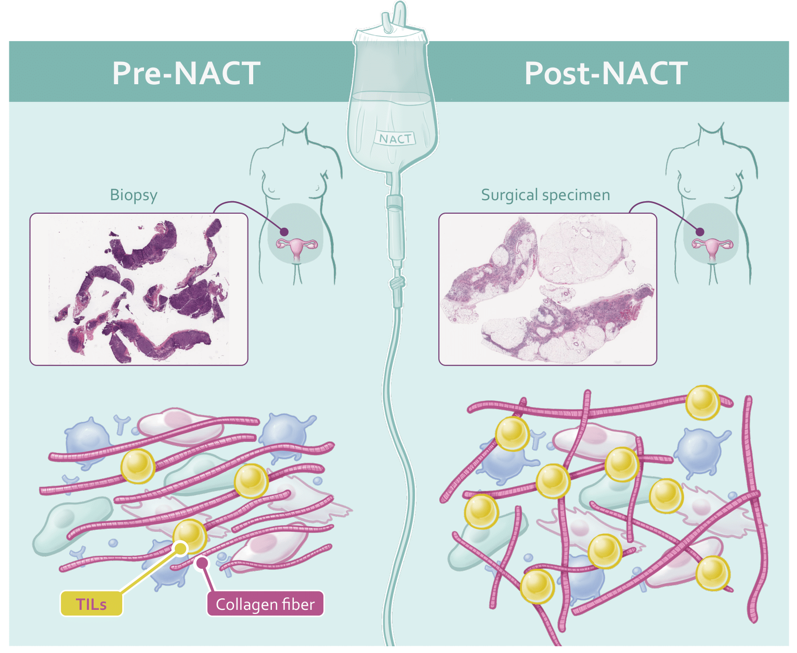
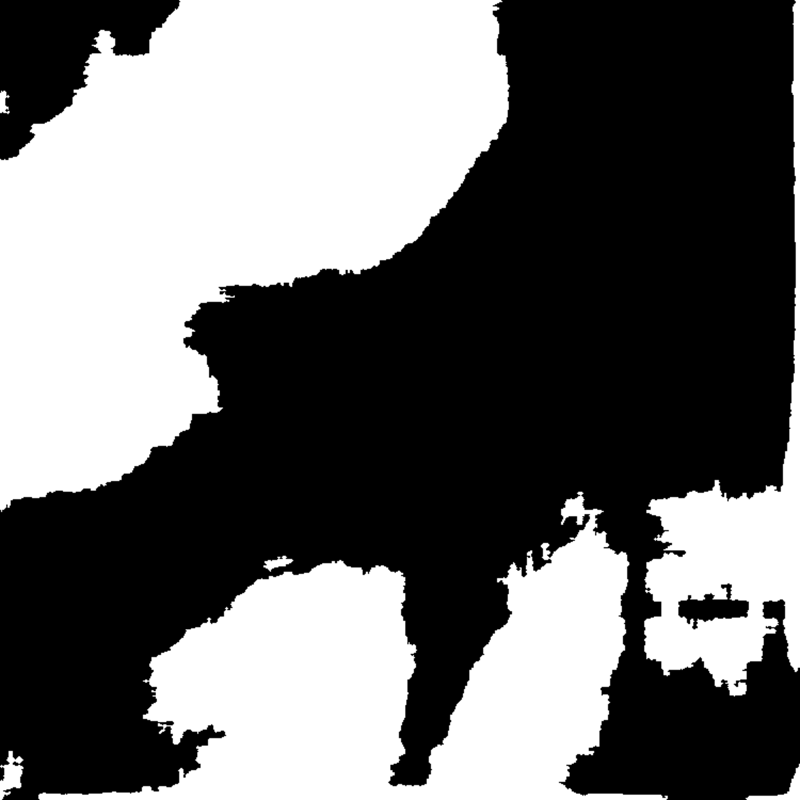
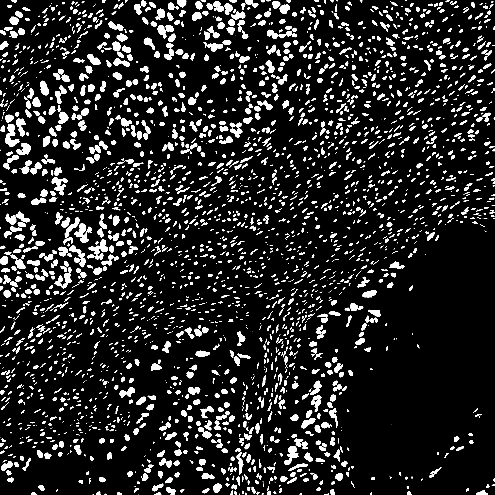

# Image Analysis Uncovers Associations between Immune Landscape, Collagen Structure, and Neoadjuvant Chemotherapy in High-Grade Serous Ovarian Carcinomas

---

## Abstract
The changes in the tumor microenvironment of high-grade serous ovarian carcinomas following neoadjuvant chemotherapy are a complex area of study. Previous research underscores the importance of investigating the immune and collagen components within the tumor microenvironment for prognostic implications. In this study, we utilized computational pathology techniques with Hematoxylin and Eosin-stained images to quantitatively characterize the immune and collagen architecture within the tumor microenvironment of patients with high-grade serous ovarian carcinoma. Our analysis of 12 pre- and post-neoadjuvant chemotherapy images revealed an increase in immune infiltrate, primarily within the epithelial region. Additionally, post-neoadjuvant chemotherapy images exhibited chaotic collagen architecture compared to pre-neoadjuvant chemotherapy images. Importantly, features extracted from post-neoadjuvant chemotherapy images showed associations with overall survival, potentially aiding in the selection of patients for immunotherapy trials. These findings offer critical insights into the changes in the tumor microenvironment of high-grade serous ovarian carcinomas following neoadjuvant chemotherapy and their potential implications for clinical outcomes. 

## Authors
Arpit Aggarwal, German Corredor, and Anant Madabhushi 

## Manuscript files
Please find the required manuscript documents over here (manuscript/Article File.docx, manuscript/Supplementary Information.docx, and manuscript/Response to Referees.docx) 

## Packages Required
Python and Matlab were used for this study. 
The packages required for running this code are PyTorch, Numpy, Openslide, PIL, OpenCV, Pandas, Sksurv, Sklearn, and Matplotlib. 

## Overview of the study

## Data used in the study

12 patients from UPMC having both pre- and post-NACT H&E image.

## Pipeline
The main steps involved are as follows:
1. Preprocessing steps (Extracting tiles from H&E-stained Whole Slide Images, Epithelium/Stroma segmentation, Nuclei segmentation)
2. Extracting collagen features
3. Extracting immune features
4. Survival analysis

## Running the code
1. <b>Preprocessing steps</b> 
a. <b>Extracting tiles from H&E-stained Whole Slide Images</b> - This extracts tiles from the whole slide image of size 3000x3000-pixel. Run the python file 'python3 code/preprocessing/extract_patches.py' (specify the 'input_path' to the location where whole slide images exist and 'output_path' where you want to store the tiles). An example extracted tile is shown below:  

b. <b>Epithelium/Stroma segmentation</b> - To segment the epithelium/stromal regions on the tiles extracted above, run the pretrained epithelium/stroma model 'python3 code/preprocessing/epithelium_stroma_segmentation.py'. The model weights file is located at 'code/preprocessing/epi_seg_unet.pth' (specify the 'input_path' to the location where tiles are extracted and 'output_path' where you want to store the epithelium/stroma segmentation masks). An example epithelium/stroma segmentation mask is shown below:  

c. <b>Nuclei segmentation</b> - To segment the nuclei regions on the tiles extracted above, run the pretrained Hovernet model (https://github.com/vqdang/hover_net). We utilized the PanNuke checkpoint model weights over here. An example nuclei segmentation mask is shown below:  

2. <b>Extracting collagen features</b> 
As described in the manuscript, for extracting the collagen features run the Matlab file (code/collagen/feature_map_for_each_tile.m) that generates the Collagen Fiber Orientation Disorder map for each tile extracted (for different tumor neighborhood sizes, you would need to change this variable 'win_size' as 200, 250, 300, 350, 400, 450, 500, 550, and 600).
(specify the 'patches_dir' to the location where tiles are extracted, 'epi_stroma_masks_dir' where epithelium/stroma segmentation masks are extracted, 'nuclei_masks_dir' where the nuclei segmentation masks are extracted, and 'collagen_masks_dir' where you want to store the feature maps for each tile.)  
After obtaining the feature maps for each tile and for each tumor neighborhood (create separate folders for each tumor neighborhood), run the Matlab file (code/collagen/patient_level_features_collagen.m) that gives patient-level features (mean, minimum, and maximum) for each patient and for each tumor neighborhood, giving a total of 27 features.
(specify the 'files_dir' to the location patient list is for the cohort, 'feature_maps_dir' where feature maps are extracted after running the Matlab file 'code/collagen/feature_map_for_each_tile.m', 'collagen_masks_dir' where you want to store the patient-level features.)  

3. <b>Extracting immune features</b> 
As described in the manuscript, for extracting the immune features for each tile run the Matlab file (code/immune/feature_for_each_tile.m).
(specify the 'HE_patch_folder' to the location where tiles are extracted, 'ES_folder' where epithelium/stroma segmentation masks are extracted, 'nuc_folder' where the nuclei segmentation masks are extracted, and 'features_store' where you want to store the features for each tile.)  
After obtaining the immune features for each tile, the patient-level features are obtained by taking the first-order statistics (mean, median, minimum, maximum, range, and variance) for the tiles of the H&E-WSI. As described in the paper (https://jitc.bmj.com/content/10/2/e003833), the top 7 features that were found prognostic by training the LASSO Cox Model on D0 cohort and these were the features that were used in this paper from the immune component of the TME.  

## License and Usage
Madabhushi Lab - This code is made available under Apache 2.0 with Commons Clause License and is available for non-commercial academic purposes.